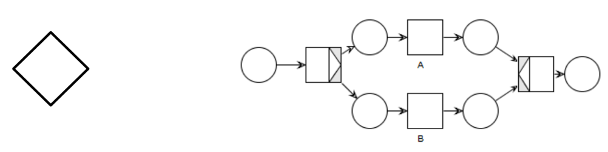
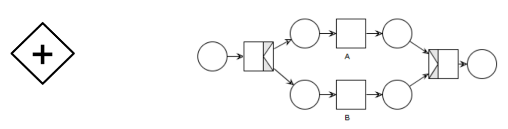
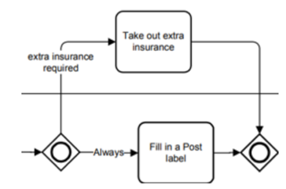
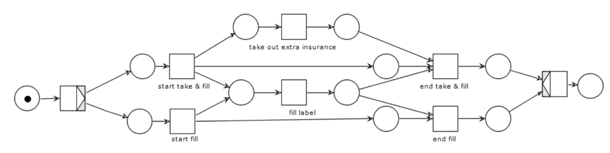

# Advanced Software Engineering
_Answered questions & Notes_

Teacher: prof. Antonio Brogi  
Autor: Aldo D'Aquino  
Accademic Year: 2018/19

## Introduction

### NOTES

 SOA: Service Oriented Architecture

Website vs web service: the first one is used by users, the second one by machines and is based on message exchanging

Evolution of software development:

OO programming → component-based software engineering → service-oriented computing: on different servers, by different providers

⟹ Quality of Services of an application depends on the QoS of the services that the application use

## Core interoperability standards (REST, SOAP/ WS-\*, WSDL)

### NOTES

REST Principles

- Resource identification through URIs
- Fixed set of operations: GET, PUT, POST, DELETE (PUT is idempotent, POST is not [RFC 2616])
- Resources decoupled from their representation: HTML, XML, JSON, plain text, PDF, JPEG…
- Stateful thanks to explicit state transfer (through hyperlinks), using a stateless communication (HTTP)

REST vs SOAP:

- REST is resource-centric, SOAP is message-centric
- REST is easy, SOAP is complex
- REST is basic, SOAP advanced
- REST is for web environments, SOAP to access objects on servers (professional/enterprise environment)
- REST navigation through hyperlinks, in SOAP there are formal contracts about objects information
- REST works also on very limited bandwidth conditions, SOAP can be used for transactions that involves multiple calls

### What is REST?

REpresentational State Transfer: is an architectural style that defines a set of constraints to be used for creating web services. It is built directly on HTTP and provide four interaction method: GET to retrieve information, PUT to create objects, POST to update it, and DELETE to delete it. There is also a Lo-REST protocol that supports only GET and POST and uses the X-HTTP-Method-Override header to set if the POST request is really a POST or is a PUT or a DELETE request.

### How can we create/update/access resources in REST?

Resources are created with the PUT HTTP method and updated with the POST one. The real difference between PUT and POST is that the PUT is idempotent, and the POST is not (RFC 2616). That means that multiple PUT requests have the same result that the last PUT request will have, instead multiple POST request has a cumulative result.

The access to resources is made with a GET request. The DELETE update a resource deleting it.

### Which are the pros and cons of REST?

PROS

-Easy to use: well-known standards (HTTP, XML, URI)
- No additional overhead: deploying similar to dynamic website, no client-side additional software needed
- Predictable endpoints, hyperlinks navigation
- Efficiency: lightweight protocol and message formats
- Scalability (stateless)
- Easier and less complex than SOAP

CONS

- Confusion between Hi-REST and Lo-REST (only GET for idempotent requests and POST for everything else, real verb sent using X-HTTP-Method-Override header)
- Encode complex data structure into an URL is difficult (Error 414: Request-URI too long)
- Not easy to be extended

### What is SOAP?

Simple Object Access Protocol: is a messaging protocol specification for exchanging structured information. It is based on XML and transported over HTTP.

### How are SOAP messages transported?

SOAP messages are based on XML and transported over HTTP. The SOAP envelope consists in an optional header with control information, and a body with the payload.

### What is WSDL?

[Pronunciation: "WiSDoL"]

Web Services Description Language: is an XML language to describe public interfaces of web services. It works really well with SOAP.

It is platform and language independent and describes a service as a set of endpoints operating on messages.

It is used to describe:

- what a service does;
- where it resides;
- how to invoke it.

It is made by an abstract interface that describes operations, parameters and abstract data type, and a concrete interface that binds the abstract interface with addresses, protocols, encodings, messaging styles (RPC or document) and concrete data structures.

### What is a request-response operation in WSDL?

Request-response is the usual messaging pattern of the client-server paradigm, in which the service receives a request and sends a response. Operations are declared as an input element followed by an output element. It is a typical RPC (Remote Procedure Call). The operation is synchronous.

The opposite exchange pattern is the one-way operation, where an endpoint receives an asynchronous call, that is an input operation not followed by an output one because the service doesn't send a response.

Finally, notification is server client and solicit-response is server-client with response client-server.

### What is a portType/port in WSDL?

The \&lt;portType\&gt; element defines a web service as a group of operations that can be performed and the messages that are involved.

In particular the portType element combines multiple message elements to form a complete one-way or round-trip operation. For example, it can combine one request and one response message into a single request/response operation. It can also define multiple operations.

### Last year's Questions

#### Which are the "communication models" of SOAP?

SOAP has two communication models:

- RPC (Remote Procedure Call) that allows client applications to call web services like objects;
- document (or message) style.

The communication can be synchronous or asynchronous.

[Check also WSDL message exchange patterns]

#### What is an abstract/concrete WSDL interface?

The abstract interface contains the declaration of messages, portTypes, and operations.

The concrete interface specifies the implementation of the abstract interface and contains the bindings, which define the message format and the protocol details.

#### Which are the "message exchange patterns" of WSDL?

- request-response (input-output operations, synchronous), is the usual messaging pattern of the client-server paradigm;
- solicit-response (output-input operations, synchronous), is similar to request-response but reverted, the server asks and the client responses;
- one-way (input-only operations, asynchronous), the client sends data to the server without requiring a response;
- notification (output-only operations, asynchronous), the server sends data to the client without a request before and doesn't wait a response.

## Microservices

### Which are the main characteristics of microservice-based architectures?

A microservice architecture divide a service in many services that works tougher. They communicate RESTfully with HTTP and each one can scale as needed.

### Which are the main pros and cons of microservices?

PROS

- Shorter time to update, rebuild and redeploy
- Scalability
- Polyglotism

CONS

- Communication overhead
- Complexity
- It is difficult to avoid data duplication while keeping microservices isolated

### What are "squads" and "tribes" at Spotify?

Squads are similar to scrum teams, consists of 6-12 people and are dedicated to work on one feature area. A squad is autonomous, self-organizing and self-managing and has an Agile Coach. Each squad has a mission to accomplish and is free to choose an agile methodology.

Multiple squads that work on the related feature area makes a tribe. A tribe may consist of 40-150 people and has a tribe lead responsible for creating a productive and an innovative environment.

### What is fault-injection testing?

Fault injection is a software testing technique by introducing faults into the code for improving the coverage and usually used with stress testing.

Usually the fault-injection testing tests the robustness of a software or a component on strange input data.

### How can &quot;design for failure&quot; be actually implemented?

Design for failure means that a system will never fail. In a system designed for failure every functions and component are ready to work also with unexpected data, i.e. wrong and strange inputs.

The design for failure can be tested with fault-injection testing.

### What is Git/GitHub?

Git is the widely used version control protocol, and GitHub the most popular service that implements git.

It allows upload code directly from the command line and organize it in repository. Each repository can be private or public (open source) and have some collaborators that cooperate to the published code.

Each bunch of work is incapsulated in a commit, that is pushed on the server. Collaborators can clone the project locally and pull the latest commits from the server to keep the local version of the project updated. To keep the development of each feature isolated developers can works on different branches and merge the modification on the master only when is totally implemented.

Is also possible to fork an existing repository into another one and make pull request to ask the owner of the repository to add the proposed changes.

### What is Flask?

Flask is a microframework for Python that helps to create webserver in a few steps.

### What is the Model-View-Controller pattern?

It Is a pattern used to separate application's concerns.

The model represents an object. It can also have logic to update controller if its data changes.

The view represents the visualization of the data that model contains.

The controller acts on both model and view. It controls the data flow into model object and updates the view whenever data changes. It keeps view and model separate.

### What is Celery?

Celery is an asynchronous task queue based on distributed message passing.

It is focused on real-time operation but supports scheduling as well.

Tasks can execute asynchronously (in the background) or synchronously (wait until ready).

### What is / How can you use OpenApi 2.0?

The OpenAPI Initiative (OAI) was created by a consortium of industry under the Linux Foundation with the aim of standardizing on how REST APIs are described with a vendor neutral description format.

The APIs description can be written in either JSON or YAML and describes addresses, ports, endpoints and paramethers.

### Last year's Questions

#### What is "horizontal scalability"?

Is the ability to scale only one microservice having as instances as you want without need to change the way the other microservices interact with it.

#### How "small" should a microservice be?

Size doesn't really matter. However, it is as small as the team behind it, and the team is usually a "2 pizzas team", that means a team that can be fed with 2 American pizzas, usually 8 people.

## Testing

### NOTES

- Validation testing: to prove that the software does what we expect it to do
- Defect testing: find unwanted changes

- Software verification: check if software meets requirements
- Software validation: check if software meets customer's expectations

- Unit test: the single module/function/class
- Component test: interfaces between "units"
- System test: interactions between components

Testing can only show the presence of errors, not their absence.

### What is development/release/user testing?

Development testing consists in testing the system during the development to easily discover bugs and defects. Examples of development testing are unit testing and component testing.

Release testing are tests performed by a separate team that tests the entire application to check if meets the stakeholders' expectations and the system requirements. Hence, they are not intended to found bugs, that is a responsible of the development team. An example of release testing is system testing, but also requirements-based testing, scenario testing and performance testing.

User testing are performed by a selected bunch of users that test the application in their environment. Examples of user testing are alpha and beta testing and acceptance testing (involves the customers and the stakeholder).

### What is partition testing?

Partition testing is a strategy for unit testing that consist in partioning the input (and output) data in classes of equivalence with common characteristics, for which the program works in a comparable way. For each partition are performed some tests on the boundary values and the ones in the middle of the partition.

### What is test-driven development?

Development methodology in which tests are written before the code. The aim of the code is to pass the tests. The code is developed incrementally and there isn't a move to the next increment until the previous one doesn't pass the tests.

This approach was introduced as part of an agile methods such as Extreme Programming.

It simplifies the debugging, increases the coverage of tests and permits regression testing (check that new edits don't brake old functionality).

### What is load testing?

Load testing is a kind of Performance Testing which determines a system's performance under real-life load conditions. This testing helps determine how the application behaves when multiple users access it simultaneously. This testing usually identifies the maximum operating capacity of an application.

### Last year's Questions

#### What is CI?

CI stands for Continuous Integration and is a development practice where developers integrate code into a shared repository frequently, preferably several times a day. Each integration can then be verified by an automated build and automated tests.

## User Stories

### NOTES

12 principles of Agile development:

1. Early and continuous delivery software
2. Welcome changing requirements
3. Deliver working software frequently
4. Business people and developers works together
5. Build projects around motivated individuals
6. Face-to-face conversation to conveying information
7. Working software is the primary measure of progress
8. Sustainable development: peace between sponsors, developers and users.
9. Technical excellence and good design
10. Simplicity
11. Self-organized teams
12. Periodically reflects on how to become more effective

### What is a user story (for)?

Users stories help to better understand the customers' and stakeholders' needs and provide a software that satisfy the requirements. Them also simplify the development and help to provide working software earlier and faster.

Each user story is a chunk of work that represent value for the customer and has this format: "As a [customer/user/stakeholder/…] I want to … so that … with priority …".

Developers should think about application the way the users think about it, i.e. in terms of the behavior the find valuable. So, they have to build software incrementally, as slices of functionality.

### What is the priority of a user story?

Each user story has a priority that helps developers to work first on the main functionality of the software. A low priority value represents the first things needed in the software to start using it. As soon as the priority increases the user stories contain units of works less important, such as optional and advanced feature. The priority is assigned by the stakeholders, so that represent what is more important for them.

### What is the effort/size of a user story?

A good user story should not take more than 2 days. Otherwise, it represents an epic and is necessary to split it in simpler stories.

### What is an epic?

An epic is a big user story that has been splitted in smaller ones or a set of user stories that can be grouped in a single functionality. Its development may require more than one sprint but all the user stories in the epic are usually assigned to the same team.

## Splitting the Monolith

### When and where to start splitting a monolith codebase?

A monolith should be splitted when the effort to rebuild and redeploy it is becoming very expensive. For example, when the cohesiveness changes into a big amount of unrelated code and component kept together, or when small changes have a big impact on the monolith involving a big effort to test, fix and deploy it again.

The monolith braking should start from the seams, finding components that can be shared with other contexts.

The refactoring should be done incrementally, increasing also the testing, and gradually split more and more. At each step code left over may help to identify new bounded context.

### How to split databases? (e.g., how to break foreign key relationships?)

A big database can be splitted according to the microservices competence. Each database table (or a set of strongly related tables) can became a single microservice. The foreign keys must be converted in checks across these microservices.

Shared static data, for example (almost read-only) database tables shared by many microservices, can be duplicated maintaining the (eventual) consistency between each copy.

Shared mutable data, i.e. databases that are frequently updated, should be converted in a separated microservice.

Split a monolith that has a database requires to split first the database, and then the monolith code.

### What about transactions when you split?

Transactions are useful to ensure consistency. In particular the all-or-nothing transaction ensure that if one or more operation in a transaction fails all the operation in the transaction already performed will be reverted.

Vulnerabilities of transactions are that if the transaction manager goes down or a component involved in the transaction doesn't respond everything blocks. Furthermore, in some cases a component can fail also after voting.

The solution is eventual consistency, that means that "sooner or later" it will be consistent. A possible implementation of eventual consistency is the SAGA pattern (see below).

### What is the SAGA pattern?

SAGA is a pattern for eventual consistency. All atomics operations are accumulated in a queue.

The saga execution controller takes the first one and start doing the operation in parallel according with the risk.

If one operation fails, there are two recovery modes:

- Backwards: undo all the successful operations;
- Forwards: retry until all re successful (operations must be idempotent).

### What is eventual consistency?

Eventual consistency means that "sooner or later" it will be consistent. It is a good compromise for when the system must be consistent but is too much expensive to have an atomic operation, e.g. when it avoids parallelism. Eventual consistency guarantee that the system will be consistent for sure, but it requires a bit of time to have it.

A possible implementation of eventual consistency is the SAGA pattern (see above).

### What is a (event) data pump?

Data pump pumps data from a primary database to a second one used for example for reporting.

Usually the secondary database needs to compact data and doesn't need the data to be always up-to-date.

A (wrong) strategy to populate the replica database is transfer data through APIs but is not such a good practice because the exposed APIs may be not designed for huge transactions and may not scale well. Data pumps pushes data directly from the primary database to the replica.

Event data pump doesn't pump data periodically but emits event every time a data of its pertinence is updated. The subscriber to the events updates its data autonomously.

Events data pumps have the advantages that the data pump is not a pertinence of the database service team and that the data is updated faster than with periodical backups. The cons is that it may not scale well.

## Cloud-based Software Engineering (Cloud Computing & Docker)

### What are the service/deployment models of cloud computing?

Service Models are IaaS, PaaS and SaaS.

IaaS stands for Infrastructure as a Service, in that case the vendor rent you an infrastructure, e.g. a VPS or a bunch of servers, on which you can build your own services on your preferred platform. The advantage of IaaS is that you can scale the computing power and the resources you need as you want, simply paying more. You don't have to invest in buying and managing the entire infrastructure.

PaaS stands for Platform as a Service. Examples of PaaS are Azure, Google Cloud Computing or AWS. They give you not only the infrastructure but also a platform on which you can run the software. This avoid you to manage the platform, just take care of the software taking advantage of the features provided by the platform. The disadvantage of the PaaS is that it involves more the problem of lock-in.

In SaaS is rented the software directly, e.g. Google Drive or Google for Enterprise, Microsoft Office 365, and so on. You just choose the software you need and pay for this service. You don't have to manage anything, the provider manage takes care of everything for you.

Deployment models are private, public and hybrid cloud.

In private cloud you have a high control but also high costs and low scalability. Instead public cloud costs less and scale more, but you have less control. The hybrid cloud is the best option for most companies, because they can store and manage sensitive information in private cloud and take advantage of the low costs and high scalability of public cloud to offer services to the customers.

### Which is an example of (disruptive) business model exploiting cloud computing?
// TODO

### What is a virtual machine? / What is server virtualization?

A virtual machine is where you actually install the OS you are used to install, and the Apps. It is an abstract machine that use the resource of the host physical machine on which runs.

Virtualization is an abstraction layer between physical server and the OS you would normally install, i.e. the layer between the host machine and the VMs.

Virtualization is implemented through a hypervisor. The type 1 hypervisor is loaded directly on the hardware, the type 2 hypervisor runs on a host OS and is less performant. Usually datacenter uses type 1, instead the type 2 is usually used by desktop users.

### What are Heroku's dynos (for)?

The Heroku dynos are container that runs on the Heroku platform. We can call it Container as a Service, you just incapsulate your software in a container and you can run and scale it on Heroku. Them are an example of PaaS, in which the platform is the container virtualization.

### What is FaaS?

FaaS stands for Function as a service that is a category of cloud computing services that provides a platform allowing customers to develop, run, and manage application functionalities without the complexity of building and maintaining the infrastructure typically associated with developing and launching an app. Is also called "serverless" architecture and is typically used when building microservices applications.

The difference between FaaS and PaaS is that in PaaS you get the entire platform, in the FaaS only the tools to run a specific service, e.g. a Node.js FaaS allows to run only a Node.js application.

An example of FaaS provider is AWS lambda, instead AWS is a PaaS.

### How to avoid/reduce cloud lock-in?

Vendor lock-in makes a customer dependent on a vendor for products or services, unable to use another vendor without substantial switching costs.

The lock-in problem grows with the abstraction of the service, that means that is low with IaaS and very high with SaaS.

Is not possible to totally avoid the lock-in problem when using PaaS and SaaS, but there are many techniques to reduce it:

- Choose carefully the provider, thinking carefully before using a proprietary service and planning an exit strategy;
- Ensure the portability of data using unified interfaces and choosing open standards and open-source technologies;
- Use loosely coupled architecture, i.e. a microservices architectures distributed on multiple clouds using API REST, containers and DevOps tools.

### What is a container/image/volume?

A container is an isolated user-space instances obtained using the filesystem isolation of host OS kernel. Each container runs an instance of an image and can be attached to a volume.

An image is made of an application and the binary and libraries that the application need. It can consist of multiple layers (see What is image layering in Docker?). An image instance is called container, and for each image there can be many running containers (instances).

A volume is a permanent storage unit (it can be a folder or a virtual drive i.e. a file) attached to a running container. Indeed, when a container stops (e.g. fails, ends, or is stopped), the storage editing is discarded.

### What is the difference between a virtual machine and a container?

Containers are multiple isolated user-space instances using the filesystem isolation of host OS kernel. That means that each process on a container runs natively on the host machine in an isolated mode.

The advantage is that this technique eliminates the overhead of the hosted OS, running a software without having to run an entire OS. That means a lighter, faster and easier to build service.

Disadvantages are that we cannot run container for OS different from the host one as in a Virtual Machine and it can be less secure because there is less isolation than in a VM.

### What is image layering in Docker?

In Docker an image can be build from scratch, starting from source files, or editing an existent one, e.g. installing Node.js on an Ubuntu image. During the latter process, at each step is generated a layer, so the result image is a composition of layers. That allow the reuse of layers, so that the data shared by different images is downloaded (and kept in memory) only one time.

### What is the effect of docker run/commit?

Docker run put in run an image creating a container, that is a running instance of that image.

Docker commit saves a running container into an image, so that we can reuse it. It is useful for distributing images obtained by editing a container, for creating snapshot or to have many instances of an image (duplicate a container).

### Last year's Questions

#### What is Docker?

Docker is an open source tool designed to make it easier to create, deploy, and run applications by using containers. Containers allow a developer to package up an application with all of the parts it needs, such as libraries and other dependencies, and ship it all out as one package.

Unlike a virtual machine, rather than creating a whole virtual operating system, Docker allows applications to use the same Linux kernel as the system that they're running on and only requires applications be shipped with things not already running on the host computer. This gives a significant performance boost and reduces the size of the application.

## Business Process Modelling (BPM)

### NOTES

BPMN: Business Process Model and Notation, is a graphical notation for business process modeling.

### What is a parallel/exclusive/inclusive gateway in BPMN?

Parallel gateway act as an AND: all branches are taken and processed in parallel, then joined when all are completed.

The Exclusive gateway act as a XOR: only one branch is taken.

An inclusive gateway split the token into one or more branches depending on formula in each flow and join it when all active input branches are completed.

### What is an error event in BPMN?

An error event is an interrupting event attached to a process. When this event occurs, the process is interrupted, and the event branch is executed instead.

Different from the error event, the escalation event is executed without interrupting the process, in parallel.

### What is Camunda?

Camunda is an open source platform for workflow and decision automation that brings business users and software developers together. Through Camunda is possible to automate a BPM using pre-prepared decision schemes or associating external workers through APIs.

### Can you describe the usage patterns of Camunda?

First a we draw the BPM diagram with Camunda Modeler, then we deploy it on Camunda. Then potential workers must be developed. Finally, we can create the process from the task list and monitor it.

### What is the difference between orchestration and choreography?

In the orchestration there is a centralized orchestrator, in choreography them are self-organized and self-orchestrated.

### What is a workflow net?

A workflow net is an extension of Petri nets and is a technique for specifying business processes in

a formal and abstract way. It has a graphical representation that helps to visualize the workflow and includes many supporting tools to analyze properties.

### How can we model BPMN parallel/exclusive/inclusive gateways with workflow nets?
#### Parallel gatway

#### Exclusive gatway

#### Inclusive gatway

### What is a live/bounded/sound net?

A Petri net is live if and only if for every reachable state M' and every transition t, there is a state M'' reachable from M' which enables t.

A Petri net is bounded if and only if for each place p there is a natural number n such that for every reachable state the number of tokens in p is less than n ("is not a black hole").

A workflow net is sound if and only if is live and bounded.

A workflow net is sound if and only if every net execution starting from the initial marking eventually leads to the final and every transition occurs in at least one net execution.

## Fog Computing

### What is fog computing?

Fog computing is a middleware between the cloud and the IoT devices. Its purpose is to aggregate data coming from the billions of IoT devices to reduce the traffic from and to the cloud.

The main advantages are:

- Low latency
- Bandwidth saving
- Location and context awareness
- Geo-distribution
- Mobility

### What is / how difficult is the "component deployment problem" in fog computing?

As for the cloud when choosing a fog node is important to put attention to the QoS and the trust of the provider. This is more difficult because of in fog computing the location of the node has an important relevance. Hence, there are many factors to take care of when deploying a fog computing layer. The mains are:

- QoS of a node
- Location and context-awareness of a node
- Link/node failure
- QoS and fault tolerance of my service/infrastructure
- Reduce/minimize resource consumption
- Keep costs affordable

### What is FogTorch?

FogTorch is a tool for probabilistic QoS-assurance and resource consumption estimation of eligible deployments of Fog applications. It helps in planning a QoS-, context- and cost-aware deployment of fog applications through models and algorithms, a Monte Carlo simulation and a cost model.

### What is SecFog?

SecFog is a tool developed by the SOCC group of the CSD of University of Pisa for deploying fog application according to the security policies.

To each component and to the application are assigned security requirements. Similarly, to each node is attached a node descriptor and to each infrastructure operator a trustworthy level.

The simulation is written in ProbLog2 that allows to assign a probability to a predicate. Running the simulation we can check the best deployment to minimize the costs while respecting the QoS and security requirements.